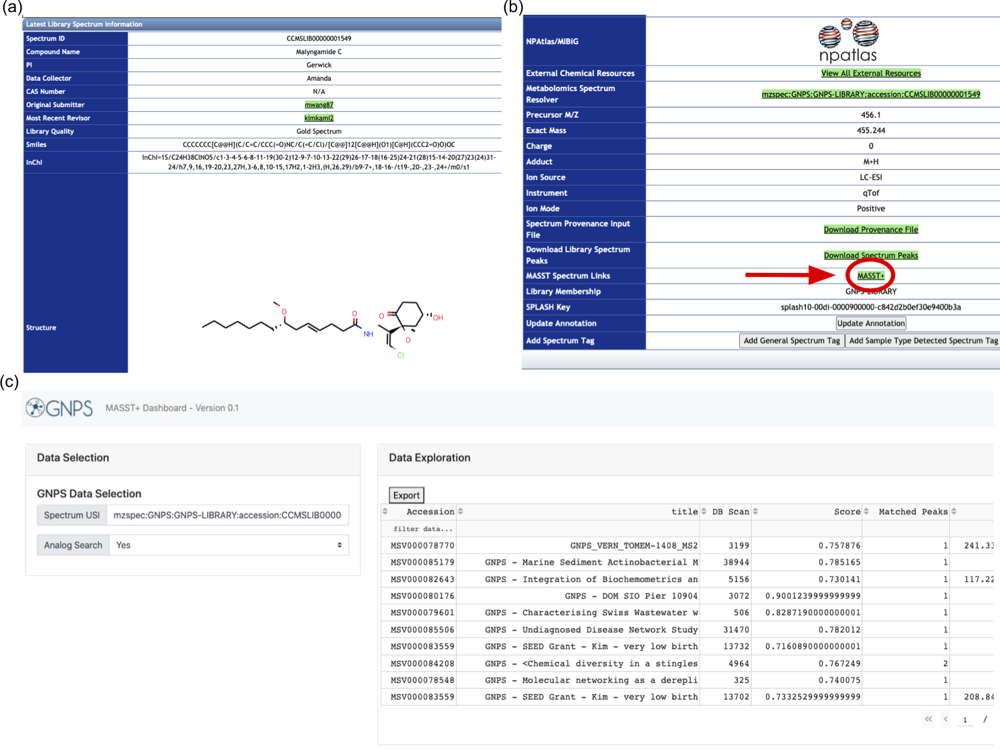
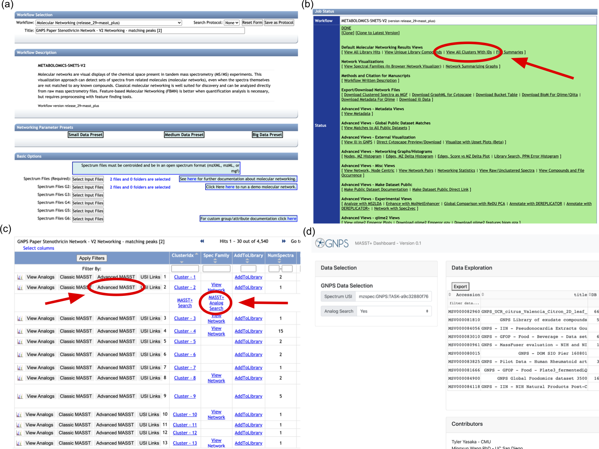

# MASST+ Server

https://masst.ucsd.edu/masstplus/

MASST+ is an improvement on GNPS Mass Spectrometry Search Tool ([MASST](https://masst.ucsd.edu/)). MASST+ provides fast and error tolerant search of metabolomics mass spectrometry data while reducing the search time by two orders of magnitude. It is capable of querying against databases of billions of mass spectra, which was not feasible with MASST. Like MASST, MASST+ is publicly available as a web service on GNPS.

## Using MASST+ Server

### With a Spectrum USI

If you know the [spectrum USI](https://github.com/mwang87/MetabolomicsSpectrumResolver) of a spectrum you want to search with MASST+, you can enter it directly at https://masst.ucsd.edu/masstplus/.

### Searching a spectrum in the GNPS library



(a) First, navigate to the spectrum of interest on the GNPS library. Here, a [Malyngamide C spectrum](https://proteomics3.ucsd.edu/ProteoSAFe/gnpslibraryspectrum.jsp?SpectrumID=CCMSLIB00000001549#%7B%7D) is viewed. Next, click the "MASST+" link. (c) This opens the MASST+ tab which runs a mass spectral search and presents the results.

### Integration with Molecular Networking



(a) Start by submitting a [new molecular networking](https://proteomics3.ucsd.edu/ProteoSAFe/index.jsp?task=a9c32880f76b4786a5a89682ed101d8f) job on GNPS (this will require you to be logged in to a GNPS account). (b) When the job has completed, click "View All Clusters With IDs". (c) This will open a new tab, where you can click "Advanced MASST" and then "MASST+ Search" (or "MASST+ Analog Search") in order to start a new MASST+ search. (d) This will open a new tab for MASST+, where the search results will display after a few seconds.


# GNPS Molecular Network

We performed molecular networking (both clustering and spectral networking) using NETWORKING+ on the entirety of GNPS. We stored the results of CLUSTERING+ and PAIRING+ in tsv format. 

## Clustering+ Results for GNPS
We split the GNPS library into 9 divisions according to different precursor mass ranges and executed CLUSTERING+ on each of them. We provide the cluster information of each spectra and the centers for all clusters. 

### Cluster information for each spectra

The output is in `tsv` format. Each row of the `tsv` output represents a spectra from GNPS library. The columns of the output represent:
- `cluster_idx` is a unique ID assigned to each cluster in the division
- `scan` is a unique ID assigned to the each spectra in the division
- `mz` is the precursor mass of the spectra
- `RTINSECONDS` is the retention time of the spectra
- `MSV_source` is the MSV library it belongs to
- `Filename` is the GNPS source file of this spectra inside MSV library
- `Local_scan` is the spectra's scan number inside its GNPS source file


The clustering+ output files for all 9 divisions can be downloaded via the following links:


[CLUSTERING+ output for division 0](https://drive.google.com/file/d/1JAIOsRXYlNVMPkUxhwZO4vogCujFPEYZ/view?usp=sharing)

[CLUSTERING+ output for division 1](https://drive.google.com/file/d/1t9ofD5fX0MPvAKxK8sUJwSb_LY9Cyb4_/view?usp=sharing)

[CLUSTERING+ output for division 2](https://drive.google.com/file/d/1B-hRy_PuJ1kUc1Hcb9VIXTlNn9uZmxiu/view?usp=sharing)

[CLUSTERING+ output for division 3](https://drive.google.com/file/d/1Tjj-8CZoMWjk-DLAYcAovOleeqVpBSZk/view?usp=sharing)

[CLUSTERING+ output for division 4](https://drive.google.com/file/d/14VufKemZJKpwcxW5FjWJ9TZIN4S9FxhN/view?usp=sharing)

[CLUSTERING+ output for division 5](https://drive.google.com/file/d/1CYI0r0TNhYt1JBY-4Dn8tKTwSWVUQKst/view?usp=sharing)

[CLUSTERING+ output for division 6](https://drive.google.com/file/d/1jgh-V6zWWzXq36hOVB88TfiHY_NjyUQb/view?usp=sharing)

[CLUSTERING+ output for division 7](https://drive.google.com/file/d/15PCqvvegkoPv7BN0XpMr42ggPUjLisf4/view?usp=sharing)

[CLUSTERING+ output for division 8](https://drive.google.com/file/d/130ZwPV7aBrHp2Y09Vuj5Xv8jSbrvKC6A/view?usp=sharing)


### Cluster centers

We write the representative spectrum of each cluster_idx into a mgf file for each division.

The representative spectra for each cluster contains: 
- `CLUSTERINDEX` is the cluster index in the division
- `CLUSTERSIZE` is the number of spectra in the cluster
- `MSV_LIB` is the source MSV library of the representative spectra
- `FILENAME` is the source GNPS file of the representative spectra
- `LOCAL_SCAN` is the scan number of the representative spectra inside the GNPS source file
- `PEPMASS` is the percursor mass of the representative spectra
- `RTINSECONDS` is the retention time of the representative spectra

```
BEGIN IONS
CLUSTERINDEX=9
CLUSTERSIZE=282
MSV_LIB=MSV000083789
FILENAME=pos_Cd10MYY_33.mgf
LOCAL_SCAN=1069
PEPMASS=53.0051
RTINSECONDS=336.875
31.991 36
38.0024 36
38.0076 36
49.9917 111
51.9917 36
52.8466 75
53.0038 1338
53.0203 40
67.9882 72
END IONS
```


The spectrum file for each division can be downloaded via the following links:

[cluster centers for division 0](https://drive.google.com/file/d/15rYEmjh_w0NWViPAyhdAyuJTLcKoKjYr/view?usp=sharing)

[cluster centers for division 1](https://drive.google.com/file/d/1QvgNqgwssMD1xwK9E6eUwyqPrDvs_4mz/view?usp=sharing)

[cluster centers for division 2](https://drive.google.com/file/d/11yIs8dTsehk6F_Lm88Y7EdX5P1_z7UUX/view?usp=sharing)

[cluster centers for division 3](https://drive.google.com/file/d/1pmFx5eEvIddgK5cevZeYuEfC-igX0FrK/view?usp=sharing)

[cluster centers for division 4](https://drive.google.com/file/d/1Bkuz0kKzQCxaf_Qh8qdpt1WC0pJABzJ6/view?usp=sharing)

[cluster centers for division 5](https://drive.google.com/file/d/14k9btagtz-a2RAyY5hzmKmHrbjZ8_o2Z/view?usp=sharing)

[cluster centers for division 6](https://drive.google.com/file/d/1AouC-HZ-qPc6bMv94lSkIzDaVM3K48z_/view?usp=sharing)

[cluster centers for division 7](https://drive.google.com/file/d/1Hjkdvz__fSdI5Uvec_XRLN0GJxhKczsp/view?usp=sharing)

[cluster centers for division 8](https://drive.google.com/file/d/18KcAnNMdQ6R7_ypVy2my2fYr-CovLG40/view?usp=sharing)

## PAIRING+ Results for GNPS
We apply PAIRING+ to the clusters resulting from CLUSTERING+ to compute the molecular network. The network is stored in two files

### Network Nodes
 The first output file stores general information for the [nodes of the GNPS molecular network](https://drive.google.com/file/d/1_jaBgPQJRxO2Gpr8hxD1Na2QZEX_Kyju/view?usp=sharing) in `tsv` format. The network contains over 8M nodes (total number of non-singleton clusters resulting from CLUSTERING+) in total.  Each row of the `tsv` output represents a node in the network. The columns of the output represent:
- `scan_number_among_centers` is a unique ID assigned to each cluster in the network
- `component_index` is a unique ID assigned to the each connected component in the network
- `source_division` is the division this cluster came from (ranges from division0 to division8)
- `cluster_index_in_division` is the index of this cluster in its source division
- `cluster_size` is the size of the cluster
- `center_MSV` is the source MSV library of the representative spectra
- `center_source_file` is the source GNPS file of the representative spectra
- `center_scan_in_source_file` is the scan number of the representative spectra inside the GNPS source file
- `center_pepmass` is the percursor mass of the representative spectra
- `center_RT` is the retention time of the representative spectra

### Network Edges

 The second output file stores general information for the [edges of the GNPS molecular network](https://drive.google.com/file/d/1hSDVBihMiM-GxZ6wHGdBh2wJdggvF1E-/view?usp=sharing) in `tsv` format. Each row of the `tsv` output represents an edge in the network. The columns of the output represent:
 
 - `connected_component_index ` is a unique ID assigned to each connected component in the network
- `first_center_scan_number` is a unique ID assigned to the each connected node in the network
- `second_center_scan_number` is a unique ID assigned to the each connected node in the network
- `product` is the similarity dot-product between the two nodes 
- `product_shared` is the contribution of shared peak matches  in the similarity score
- `product_shifted` is the contribution of shifted peak matches in the similarity score


